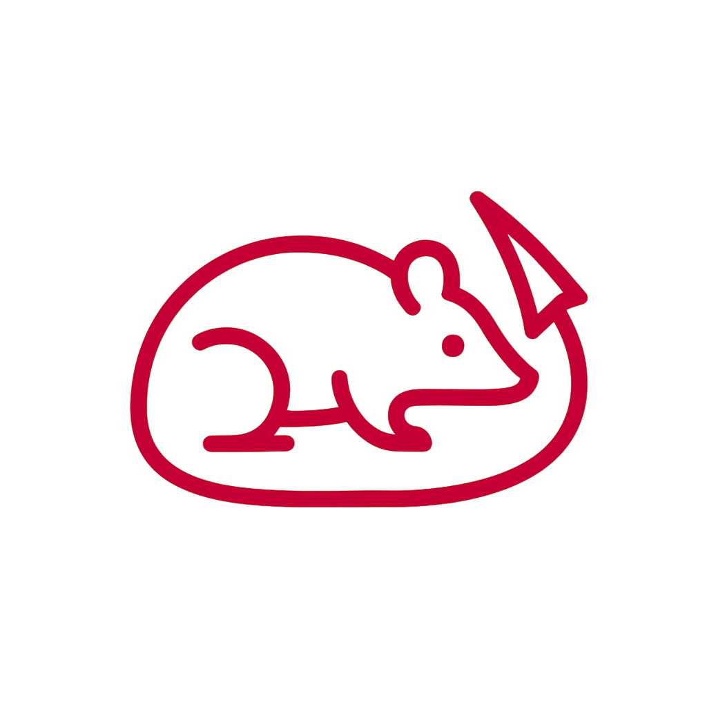

# AuPoSoNe

AuPoSoNe stands for **Au**tomated **Po**st on **So**cial **Ne**tworks. This project aims to automatically fetch, process, and post gaming content on social networks.



## Table of Contents

1. [About](#about)
2. [Installation](#installation)
3. [Usage](#usage)
4. [Project Structure](#project-structure)
5. [Status](#status)

## About

This repository is about an automated content creation and publishing system that:

- Fetches trending gaming clips from Twitch
- Processes and edits videos for social media format (Instagram Reels)
- Automatically uploads content to cloud storage (Dropbox)
- Publishes optimized videos to Instagram
- Handles the entire pipeline from content discovery to publication

This project was developed as an automation solution for social media content creators who want to maintain consistent posting schedules with trending gaming content. It leverages multiple APIs and services to create a seamless workflow from content discovery to publication, helping content creators focus on strategy rather than manual tasks.

## Installation

To locally install and run the automation system, follow these steps:

1. **Clone the repository**:

```bash
git clone https://github.com/Victor-Pavageau/AuPoSoNe.git
```

2. **Navigate to the project directory**:

```bash
cd AuPoSoNe
```

3. **Install the required dependencies**:

Make sure you have the following installed :

- Python 3.8+
- FFmpeg 7.1.1
- Chrome browser (for Selenium)

Then install the code dependencies by running the following command

```bash
pip install -r requirements.txt
```

4. **Set up environment variables**:

Create a `.env` file in the root directory with the following variables:

```env
TWITCH_CLIENT_ID=your_twitch_client_id
TWITCH_CLIENT_SECRET=your_twitch_client_secret
INSTAGRAM_ACCESS_TOKEN=your_instagram_access_token
INSTAGRAM_USER_ID=your_instagram_user_id
DROPBOX_ACCESS_TOKEN=your_dropbox_access_token
```

5. **Run the automation system**:

```bash
python run.py
```

## Project Structure

```
AuPoSoNe/
├── run.py                  # Simple entry point
├── requirements.txt        # Dependencies
├── .env                    # API keys (not in git)
├── src/                    # Organized code modules
│   ├── main.py             # Main orchestrator
│   ├── config/             # Settings management
│   ├── services/           # Main application logic
│   └── utils/              # Helper functions
```

## Usage

The system automatically processes gaming clips by:

1. Fetching trending clips from Twitch for the specified game (default: Valorant)
2. Downloading and processing the videos for Instagram Reels format
3. Uploading processed videos to Dropbox for cloud storage
4. Publishing the content to Instagram with automatic retry logic

You can customize the game and number of clips by modifying the configuration in `src/config/settings.py`.

## Status

**Development**: The development of this project started on July 2025 and is still ongoing.

**Maintenance**: This project is actively maintained.

**Future updates**: Versions v1 through v4 are included in the development roadmap and are planned for continuous deployment and delivery from July 2025 through February 2027. The current version is v1, with its final release planned for October 2025.
